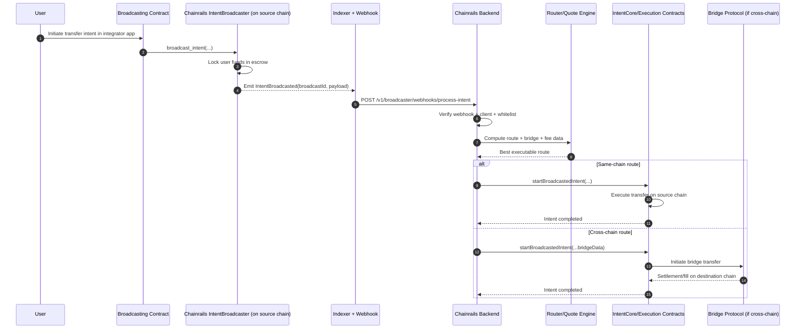

## Overview

The Chainrails Intent Broadcaster enables contract-level integrations with Chainrails. It allows protocols to create intents directly from their smart contracts instead of via API calls, with funds escrowed on-chain and processed automatically.

## How It Works
 

The diagram above illustrates the flow:

1. **Your contract broadcasts an intent**
  - Your integration contract calls `broadcast_intent`.
  - Chainrails escrows the funds and emits `IntentBroadcasted` with a `broadcastId`.

2. **Chainrails picks the best route**
  - The event is indexed and sent to the backend.
  - Chainrails validates the caller and computes the best executable route.

3. **Chainrails executes on-chain**
  - The backend calls `startBroadcastedIntent` with route data for on-chain execution.

4. **Intent settles and completes**
  - Funds are fulfilled to the destination based on the selected route.

## Broadcasting an Intent
To broadcast an intent from your contract, you simply need to interface with the `IntentBroadcaster` contract on the source chain.

Method name depends on your chain:
- EVM: `broadcastIntent`
- Starknet/Solana: `broadcast_intent`

This takes in parameters such as:

- The broadcasted intent payload (`sourceChain`, `destinationChain`, `bridgeTokenOutOptions`, `sender`, `refundAddress`, `destinationRecipient`)
- `deposits` — an array of tokens and amounts to be escrowed for the intent.
- `maxFeeBudget` — the maximum fee budget for the intent, which can be used to cover execution fees on the destination chain. Leave this as 0 to use paymaster for fee payment.
- `isLive` — A boolean indicating if it's a production intent or a test intent. We currently only support production intents, so this should be set to `true`.

We've created full example contracts in Solidity, Cairo and Rust for EVM, Starknet and Solana respectively, demonstrating how to broadcast intents from your contracts, you can find them below:
- [Solidity Example](https://github.com/horuslabsio/chainrails-demo/blob/main/contracts/solidity)
- [Cairo Example](https://github.com/horuslabsio/chainrails-demo/blob/main/contracts/starknet)
- Rust example (coming soon)

## Whitelisting Contracts
To ensure security and prevent unauthorized use, only whitelisted contracts can broadcast intents for a particular client. To whitelist your contract, you need to:

1. Sign up for a Chainrails account on the [Chainrails Dashboard](https://dashboard.chainrails.io).
2. Head to Settings -> Whitelisted Contracts
3. Add the chain and contract address of your integration contract.

Once your contract is whitelisted, you should be able to broadcast intents directly from your contract.

## Notes
The `IntentBroadcaster` currently only supports the USDC token. Support for additional tokens is coming soon.